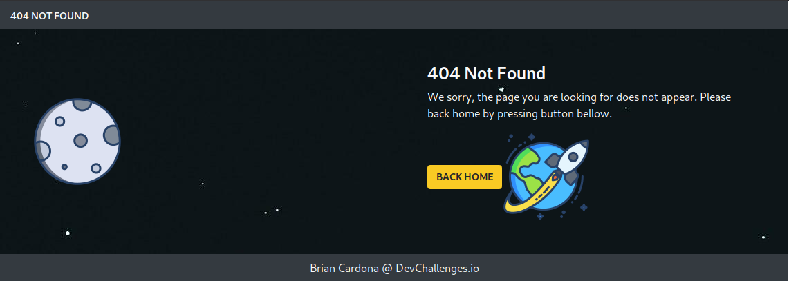

<!-- Please update value in the {}  -->

<h1 align="center">404 Not Found Challenge</h1>

   Solution for a challenge from  <a href="http://devchallenges.io" target="_blank">Devchallenges.io</a>.

  <h3>
    <a href="https://404nfchallenge.netlify.app">
      Demo
    </a>
     | 
    <a href="https://github.com/bcarlu/404-NotFound-Challenge">
      Solution
    </a>
     | 
    <a href="https://devchallenges.io/challenges/wBunSb7FPrIepJZAg0sY">
      Challenge
    </a>
  </h3>

<!-- TABLE OF CONTENTS -->

## Table of Contents

- [Overview](#overview)
- [Built With](#built-with)
- [Features](#features)
- [Contact](#contact)
- [Acknowledgements](#acknowledgements)

<!-- OVERVIEW -->

## Overview

En este proyecto se ha desarrollado una pagina estatica con el mensaje de error 404. Aqui se puso en practica el desarrollo de paginas web responsive la cual es adaptativa segun el tamaño del monitor. Se han utilizado los frameworks React JS y Bootstrap. Se incluye:

- Grid de Bootstrap.
- Estilos de Bootstrap.
- Componentes de React.

In this project we have developed a static page with the error message 404. Here was implemented the development of responsive web pages which is adaptive to the size of the monitor. We have used the frameworks React JS and Bootstrap. It is included:

- Bootstrap grid system.
- Bootstrap styles.
- React components.

### Built With

<!-- This section should list any major frameworks that you built your project using. Here are a few examples.-->

- [React](https://reactjs.org/)
- [Bootstrap](https://getbootstrap.com/)

## Features

<!-- List the features of your application or follow the template. Don't share the figma file here :) -->

This application/site was created as a submission to a [DevChallenges](https://devchallenges.io/challenges) challenge. The [challenge](https://devchallenges.io/challenges/wBunSb7FPrIepJZAg0sY) was to build an application to complete the given user stories.

## Acknowledgements

<!-- This section should list any articles or add-ons/plugins that helps you to complete the project. This is optional but it will help you in the future. For exmpale -->

## Contact

- Linkedin [Brian Cardona](https://www.linkedin.com/in/brian-cardona-lujan-7a32371ab)
- GitHub [@bcarlu](https://{github.com/bcarlu})
